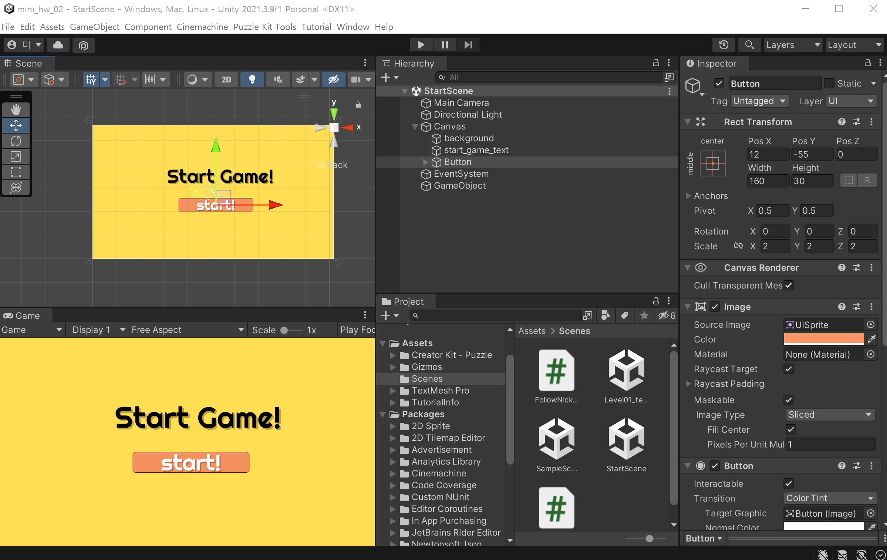
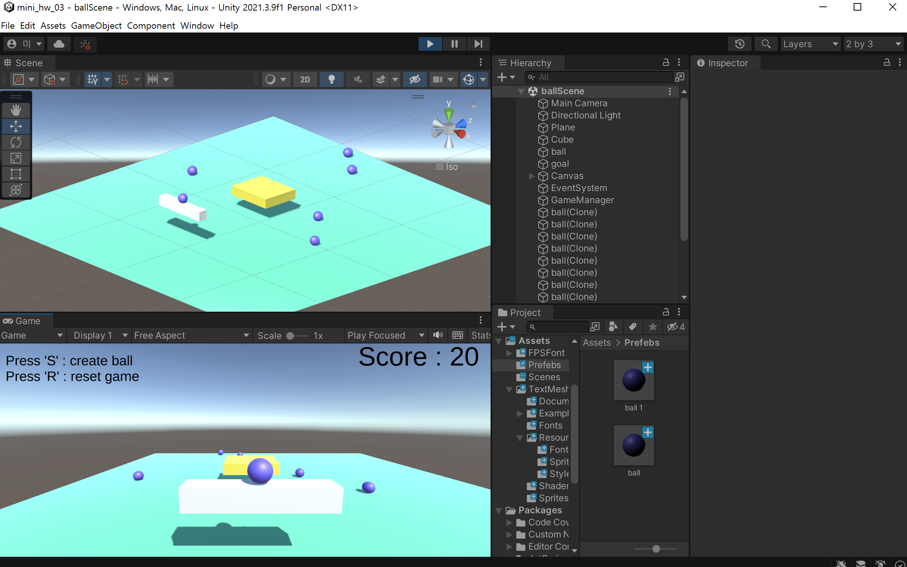
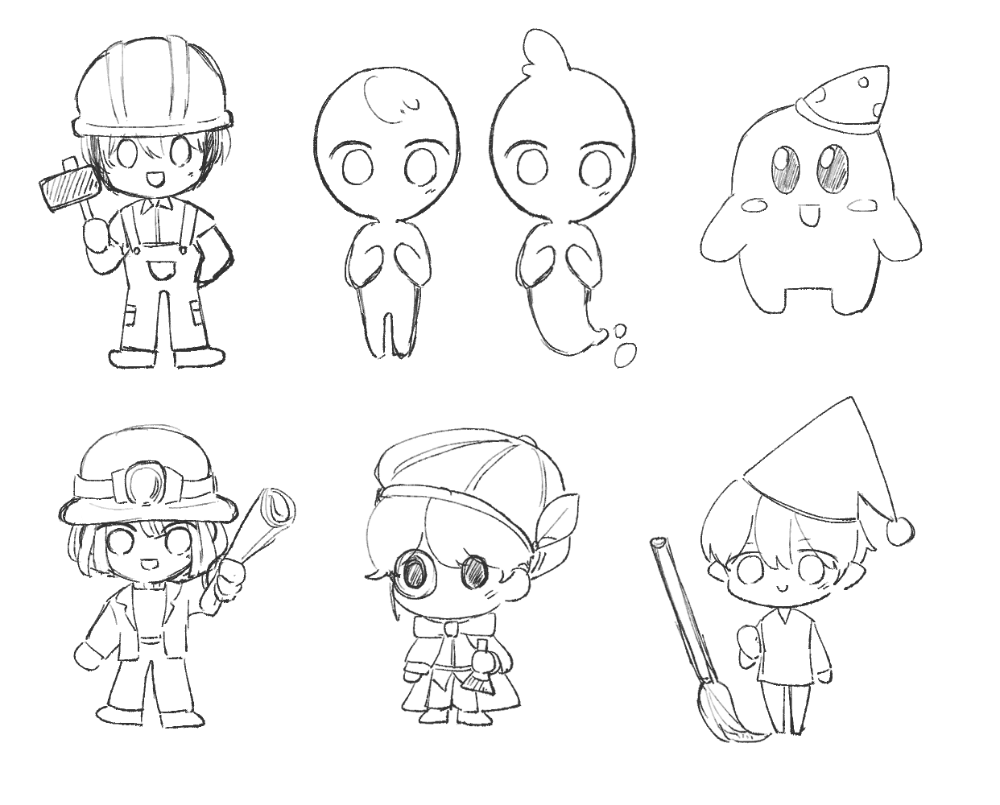

## 메타버스 게임 특강


### Day 01

- 유니티가 무엇인지, 왜 유니티를 많이 사용하는지에 대해 알게 되었다.

- 유니티 vs 언리얼 엔진

| 유니티 | 언리얼 엔진 |
|-------|-----------|
|C# 스크립트 사용| C++ 스크립트 사용|
|개발이 쉽고 빠름| 그래픽 품질이 우수함|
|무료 에셋이 많음| 확장성이 높음|
|모바일 개발이 편리함|고사양 하드웨어 요구|
|소규모 개발에 적합| 대규모 개발에 적합|

==> 따라서 우리의 프로젝트는 유니티를 사용하는 것이 좋을 것 같다고 생각하였다. (소규모 개발 / 무료 에셋이 많아 다양한 사용 가능)

---------

### Day 02

- 실제 과제 수행을 통해 유니티의 기본 조작법을 익힌다.



- 유니티의 화면은 이렇게 생겼다. 실제로 작업을 진행하는 화면, 게임 플레이를 할 때 보여지는 화면, 그리고 프로젝트 안에 들어있는 에셋, 레이어들을 보여주는 하이어아키, 특정 물체를 클릭하면 해당 물체의 특성, 색상 등을 바꿀 수 있는 화면으로 구성되어 있다. (해당 레이아웃은 설정을 통해 바꿀 수 있다.)
- 하나의 화면, 즉 장면을 씬이라고 하는데, 이번 과제에서는 씬에서 특정 버튼을 클릭하면 다른 씬으로 넘어가는 것을 수행하였다. C# 함수를 이용해 다른 씬으로 넘어가는 이벤트를 수행할 수 있다.

-----------

### Day 03

- 실제 과제 수행을 통해 유니티를 익힌다.



- 이번엔 마우스 클릭 및 키보드 클릭에 따른 액션을 만들 수 있다. 

```c#
using UnityEngine.SceneManagement;

if(Input.GetKeyDown(KeyCode.R))
{
  SceneManager.LoadScene(0);
}

if(Input.GetKeyDown(KeyCode.S))
{
  Instantiate(ball);
}
```

- 여기서 신기했던 점은 키보드 S 를 누르면 공이 다시 생성되는 점이었는데, 핵심은 공을 프리팹(prefabs)으로 만드는 것이었다. 이걸 프리팹으로 만들어서 여러번 사용할 수 있도록 하는 것이었는데, 이걸 이용하게 되면 하나의 만들어둔 것을 계속 재사용하는 것이라 같은 것을 또 만들 필요가 없다는 장점이 있다.


-----------

### 꿈지기 캐릭터 구체화 러프

